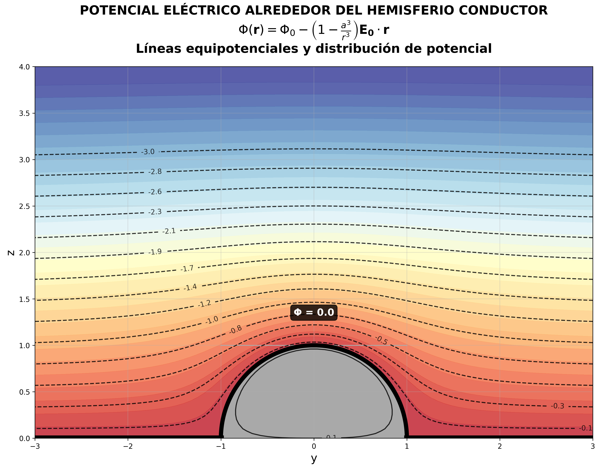

# Taller de Electrodinámica Clásica

Este repositorio contiene las simulaciones y visualizaciones para el taller de electrodinámica clásica, implementando soluciones numéricas para problemas de campos eléctricos y potenciales.

## Contenido

### 1. Potencial Eléctrico y Equipotenciales



Para ejecutar la simulación del potencial eléctrico:
```bash
python potencial.py
```


### 2. Campo Eléctrico


Para ejecutar la simulación del campo eléctrico:
```bash
python campo.py
```

### 3. Simulación ART-MS Trap


Para ejecutar la simulación del ART-MS Trap:
```bash
python ART_MS_Trap.py
```

### 4. Simulaciones Adicionales


Para ejecutar simulaciones adicionales del campo eléctrico:
```bash
python Campo_electrico.py      # Para la visualización 2D
python Campo_electrico_3D.py   # Para la visualización 3D
```

## Ejecución Automática

Para ejecutar todas las simulaciones de forma automática, utiliza el archivo batch:
```bash
run_simulations.bat
```

Este archivo creará un entorno virtual, instalará las dependencias necesarias y ejecutará todas las simulaciones en secuencia.

## Requisitos

- Python 3.7+
- NumPy
- Matplotlib
- SciPy

## Instalación Manual

```bash
python -m venv venv
venv\Scripts\activate
pip install numpy matplotlib scipy
```
